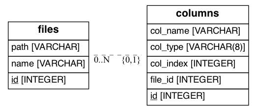

# CSV PoC

This project provides a small, Flask-based API for processing CSV files.

## Getting Started - Docker

The easiest way to start working with this project is by using Docker (no installing requirements in a virtual environment!). Once Docker is up and running on your system, these commands will run the applicaiton:

```shell
# rename the sample environment file (make sure you check the values!)
$ mv .flaskenv_sample .flaskenv

# if you want the container to run in the shell (not in the background)
$ docker-compose up web

# if you want the container to run in the background
$ docker-compose up -d web
```

Once up and running, the Swagger page for the API should be available at [http://127.0.0.1:5000/api/v1](127.0.0.1:5000/api/v1)

## Getting Started - Local/Development

Required packages for this project are in `requirements.txt`, however if you choose to include the development-related tools there is a seperate `requirements_dev.txt`. To install these packages:

```shell script
# in the repository directory, set up the virtual environment
$ python3 -m venv venv

# activate the environment
$ . ./venv/bin/activate

# install deps
$ pip install -r requirements.txt
```

Next, you can set environment variables and run the Flask application:

```shell
# for more debug-related data in the logs, set the environment
$ export FLASK_ENV=development

# point the Flask CLI to the local run file
$ export FLASK_APP=autoapp.py

# the application defaults to a local SQLite database so this is NOT NEEDED, but if that needs
# to be changed to something else, set that here
$ export DATABASE_URI=<database URI string>

# set up the database tables
$ flask db migrate

# run the application
$ flask run
```

## Interacting with the API

Whether you use Docker or run the app locally, the API Swagger page can now be accessed at [http://127.0.0.1:5000/api/v1/](http://127.0.0.1:5000/api/v1/). This page provides an interactive way to see all the routes and test their functionality. At the bottom of the page it also lists the "models", or data structures, registered with the API.

From a local shell environment, you can also simply call `cURL`:

```shell
$ curl -X 'GET' \
  'http://127.0.0.1:5000/api/v1/files' \
  -H 'accept: application/json'
```

Lastly, you can set up Postman to interact with the API. See the [Commands](#commands) section on how to generate a Postman collection automatically, and how to show all available routes from the CLI.

## Architecture

### Structure

Though this is a very small API, this project embraces Flask's [Blueprint](https://flask.palletsprojects.com/en/2.1.x/blueprints/#why-blueprints) system to keep code modular from the beginning.

Directory structure is laid out like so:

```shell script
csv-poc/
├── csv_poc
│   ├── api
│   │   └── v1
│   ├── database
│   │   └── models
│   └── utils
├── logs
├── migrations
│   └── versions
└── tests
    ├── functional
    └── unit


```

Some directories that may stand out:

- `migrations` Thanks to `alembic` and `flask-migrate` packages, database initialization and migration is easily handled with the Flask CLI. The "migrations" are stored here.
- `csv_poc/api/v1` Using Flask's Blueprint system, and a logical grouping of files within the `v1` directory, it becomes very easy to introduce different versions of the API in the future.

### Database

This project uses SQLite for the lightweight needs of the API. In the `docker-compose.yml` file you can see how to use an alternative datastore such as Postgresql.

There is a table for tracking database migrations, but that is not used for storing any data related to the API. The core schema consists of just 2 tables with a one-to-many relation:



## Commands

Flask uses the `click` package behind-the-scenes to enable custom commands. The ones defined for this project are located in [csv_poc/commands.py](csv_poc/commands.py). They are intended to make certain actions a little easier:

| Command | Purpose                                                                                                                                                                         |
|---------|---------------------------------------------------------------------------------------------------------------------------------------------------------------------------------|
| `test`   | Run all test suites for the application. Optionally can use the `-c` flag to also generate a coverage report.                                                                   |
| `postman` | Generates a Postman collection automatically from the application's API. This command has a few flags, namely `-f` which allows you to output to a file instead of the console. |
| `routes` | Built-in functionality from Flask, this command simply outputs all the application routes to the console in a pretty, formatted fashion.                                        |

All commands support the `--help` flag for details on additional options with each command.

## Testing

For running tests, see the previous section [Commands](#commands).

Pytest is used with this application in order to run both unit and functional tests. The tests are arranged by directory accordingly.
